## Overview

This project tackles credit card fraud detection — a classic machine learning problem where the challenge isn't just building a model, but handling an extreme **class imbalance**: only **0.17%** of 284,807 European transactions are fraudulent. A model that predicts "not fraud" every single time achieves 99.83% accuracy — yet misses every fraud case.

We compare two classifiers and examine what good performance actually means when the classes are this skewed.

**Dataset:** 284,807 credit card transactions · 492 fraud cases (0.17%) · Features V1–V28 (PCA-anonymized), Time, Amount

---

## Exploratory Data Analysis

### Class Imbalance

```python
import pandas as pd
import seaborn as sns
import matplotlib.pyplot as plt

df = pd.read_csv("creditcard.csv")

sns.countplot(x="Class", data=df)
plt.title("Class Distribution (0 = Legit, 1 = Fraud)")
plt.show()

print(f"Fraud rate: {df['Class'].mean() * 100:.4f}%")
# → Fraud rate: 0.1727%
```

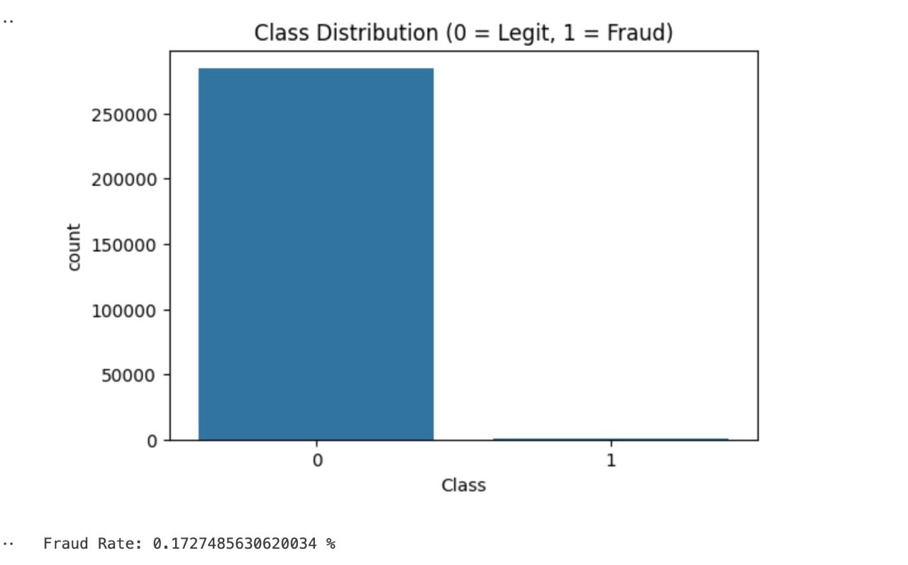

The imbalance is extreme. This is why we use **Precision, Recall, ROC AUC, and PR AUC** — not accuracy.

### Transaction Timing

```python
plt.hist(df["Time"], bins=50, color="teal")
plt.title("Distribution of Transactions Over Time")
plt.xlabel("Time (seconds)")
plt.show()
```

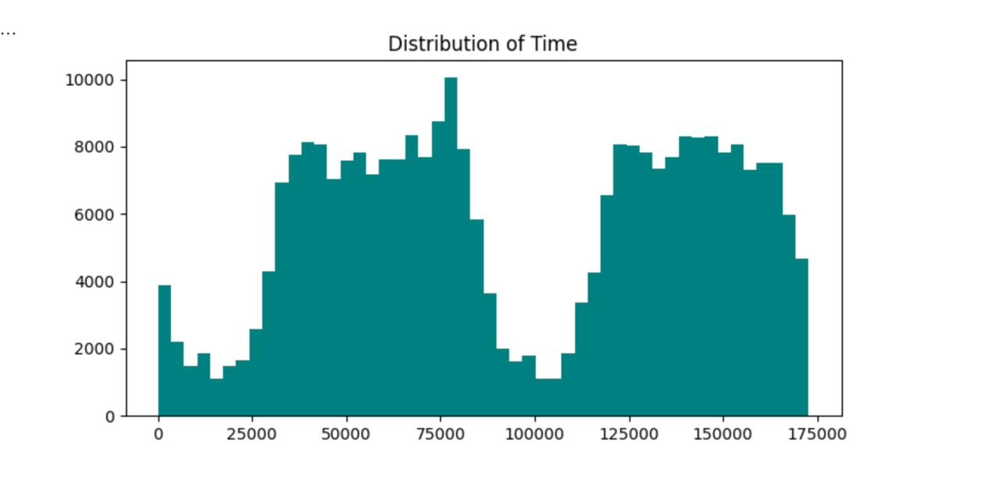

### Correlation with Fraud

```python
corr = df.corr()[["Class", "Time"]]
high_corr = corr[corr.abs().max(axis=1) > 0.2]
high_corr.sort_values(by="Class", key=lambda x: x.abs(), ascending=False)
```

```
       Class      Time
Class  1.000 -0.012
V17   -0.326 -0.073
V14   -0.303 -0.099
V12   -0.261  0.124
V10   -0.217  0.031
```

**V17** is the strongest single predictor of fraud (r = −0.33). Most high-signal PCA components are negatively correlated with fraud — very negative values of V17, V14, and V12 are warning signs.

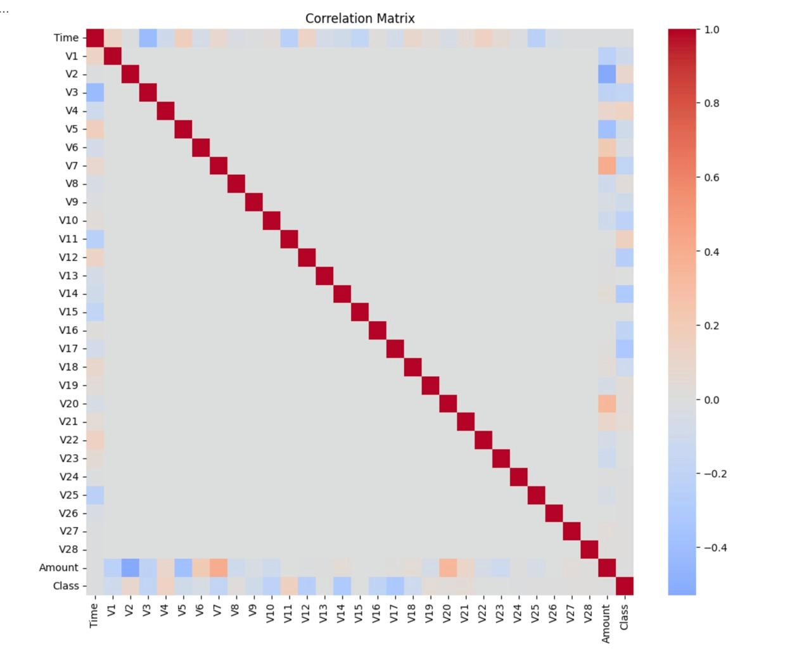

### Amount by Class

```python
sns.boxplot(x="Class", y="Amount", data=df, palette="Set2")
plt.ylim(0, 500)
plt.title("Transaction Amount by Class")
plt.show()
```

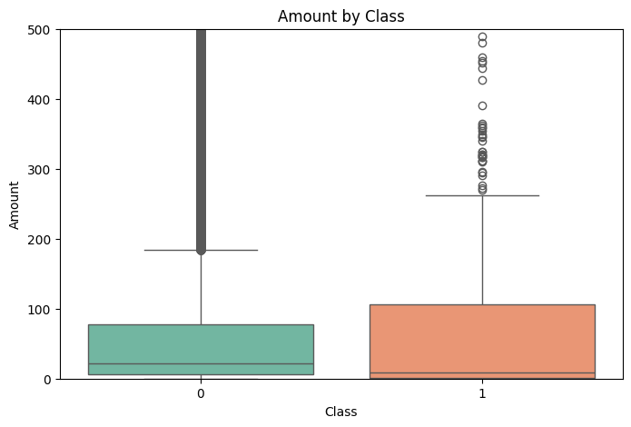

### PCA Projection

```python
from sklearn.decomposition import PCA

pca = PCA(n_components=2)
pca_comp = pca.fit_transform(df.drop("Class", axis=1))

plt.scatter(pca_comp[:, 0], pca_comp[:, 1], c=df["Class"], cmap="coolwarm", s=2)
plt.title("PCA Projection: Fraud (red) vs. Normal (blue)")
plt.show()
```

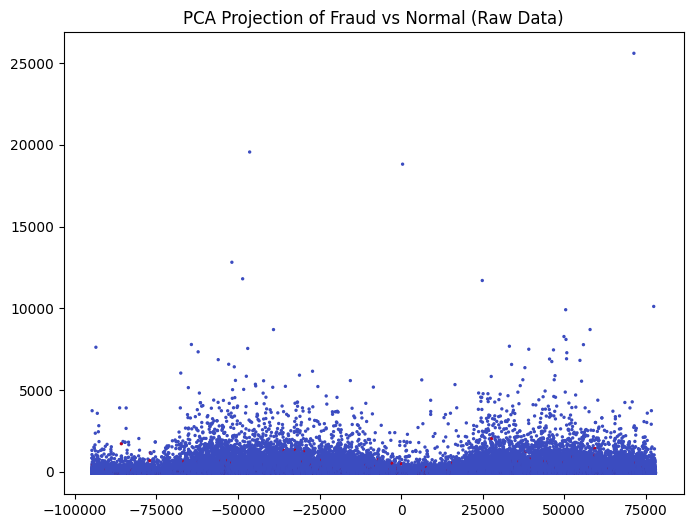

---

## Data Preprocessing

```python
from sklearn.preprocessing import RobustScaler
from sklearn.model_selection import train_test_split
from imblearn.under_sampling import RandomUnderSampler

# Scale Amount and Time (V1–V28 are already standardized)
rob_scaler = RobustScaler()
df["scaled_amount"] = rob_scaler.fit_transform(df[["Amount"]])
df["scaled_time"]   = rob_scaler.fit_transform(df[["Time"]])
df = df.drop(["Amount", "Time"], axis=1)

X, y = df.drop("Class", axis=1), df["Class"]

# Stratified 80/20 split
X_train, X_test, y_train, y_test = train_test_split(
    X, y, test_size=0.2, stratify=y, random_state=42
)

# Random undersampling → 50/50 fraud/non-fraud in training set only
rus = RandomUnderSampler(random_state=42)
X_train_res, y_train_res = rus.fit_resample(X_train, y_train)
```

**Why undersample?** Without rebalancing, a model trained on 99.83% non-fraud data simply learns to always predict "not fraud." By reducing non-fraud training examples to match fraud count (492 each), we force the model to learn what distinguishes fraud. The **test set stays imbalanced** to reflect real deployment conditions.

---

## Model 1 — Logistic Regression

```python
from imblearn.pipeline import Pipeline
from sklearn.preprocessing import StandardScaler
from sklearn.linear_model import LogisticRegression

pipe = Pipeline([
    ("scale", StandardScaler()),
    ("clf",   LogisticRegression(max_iter=1000))
])
pipe.fit(X_train_res, y_train_res)

y_pred  = pipe.predict(X_test)
y_proba = pipe.predict_proba(X_test)[:, 1]
```

### Results

| Metric | Value |
|:-------|------:|
| Recall (fraud caught) | **91.8%** |
| Precision (flagged = real fraud) | 6.0% |
| False positives | 1,402 |
| ROC AUC | **0.976** |
| PR AUC | 0.650 |

**Recall = 91.8%** — catches 90 of 98 fraudulent transactions. The low precision (6%) is a direct consequence of the imbalance: even a small false-positive rate translates to thousands of mis-flagged legitimate transactions.

### Confusion Matrix

```python
from sklearn.metrics import confusion_matrix
import seaborn as sns

cm = confusion_matrix(y_test, y_pred)
sns.heatmap(cm, annot=True, fmt="d", cmap="Blues",
            xticklabels=["Predicted 0", "Predicted 1"],
            yticklabels=["Actual 0", "Actual 1"])
plt.title("Confusion Matrix – Logistic Regression")
plt.show()
```

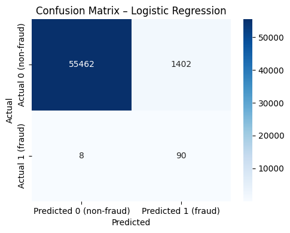

### ROC Curve

```python
from sklearn.metrics import roc_curve, roc_auc_score

fpr, tpr, _ = roc_curve(y_test, y_proba)
plt.plot(fpr, tpr, label=f"AUC = {roc_auc_score(y_test, y_proba):.3f}")
plt.plot([0, 1], [0, 1], linestyle="--", label="Random model")
plt.title("ROC Curve – Logistic Regression")
plt.show()
```

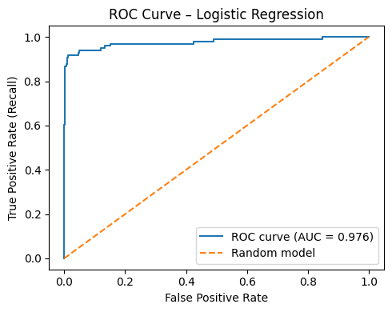

### Precision–Recall Curve

```python
from sklearn.metrics import precision_recall_curve, average_precision_score

precision, recall, _ = precision_recall_curve(y_test, y_proba)
plt.plot(recall, precision, label=f"AP = {average_precision_score(y_test, y_proba):.3f}")
plt.title("Precision–Recall Curve – Logistic Regression")
plt.show()
```

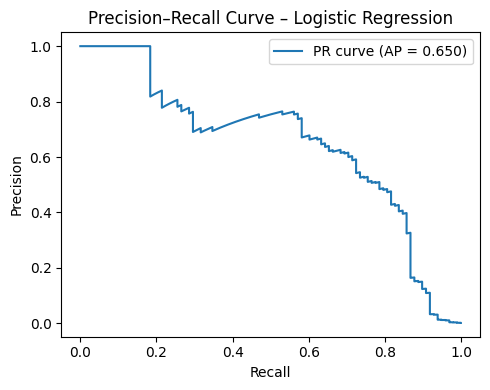

The PR curve is more informative than ROC for imbalanced data because it focuses on the minority class. The steep drop-off shows the bank's fundamental tradeoff: higher recall = more false alarms.

### Predicted Fraud Probability Distribution

```python
import pandas as pd

proba_df = pd.DataFrame({"prob": y_proba, "Class": y_test.values})
sns.kdeplot(data=proba_df[proba_df["Class"]==0]["prob"], fill=True, alpha=0.4, label="Non-fraud")
sns.kdeplot(data=proba_df[proba_df["Class"]==1]["prob"], fill=True, alpha=0.6, label="Fraud")
plt.title("Predicted Fraud Probability Distributions")
plt.show()
```

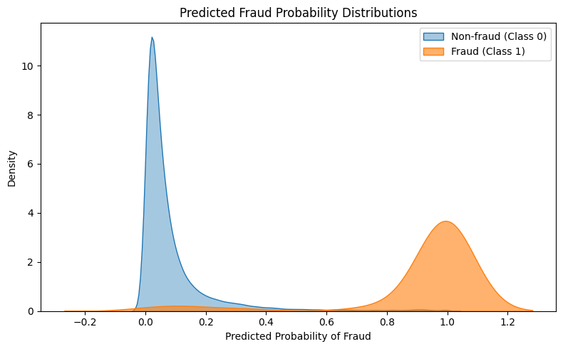

---

## Model 2 — Decision Tree

```python
from sklearn.tree import DecisionTreeClassifier

tree = DecisionTreeClassifier(max_depth=6, random_state=42)
tree.fit(X_train_res, y_train_res)

y_pred_dt  = tree.predict(X_test)
y_proba_dt = tree.predict_proba(X_test)[:, 1]
```

### Results

| Metric | Value |
|:-------|------:|
| Recall (fraud caught) | 89.8% |
| Precision | 1.8% |
| False positives | **4,701** |
| ROC AUC | 0.908 |

The Decision Tree generates **3× more false positives** than Logistic Regression (4,701 vs. 1,402).

### Confusion Matrix

```python
cm_dt = confusion_matrix(y_test, y_pred_dt)
sns.heatmap(cm_dt, annot=True, fmt="d", cmap="Reds")
plt.title("Confusion Matrix – Decision Tree")
plt.show()
```

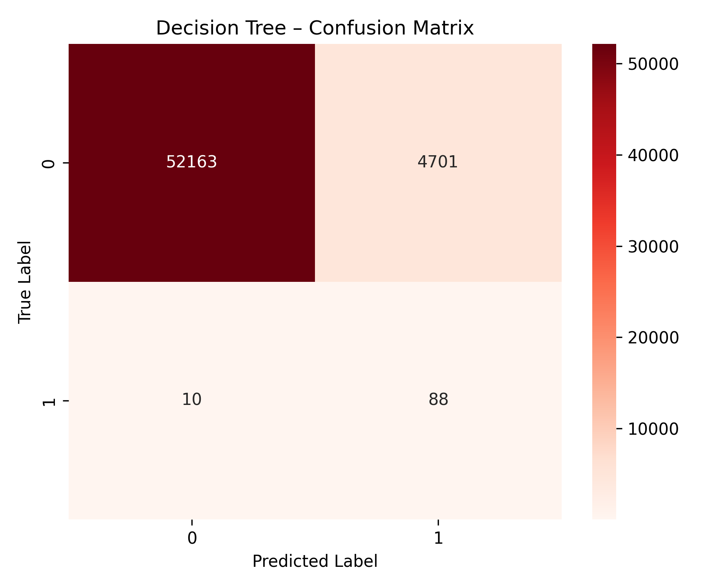

### ROC & Precision–Recall Curves

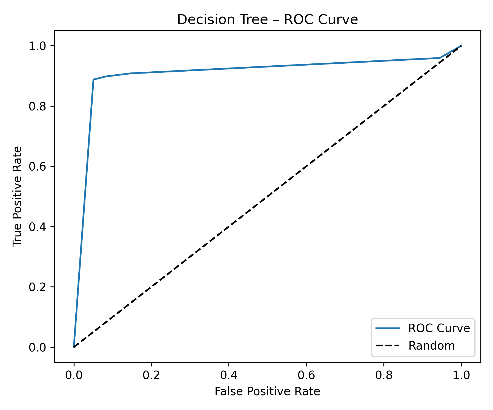

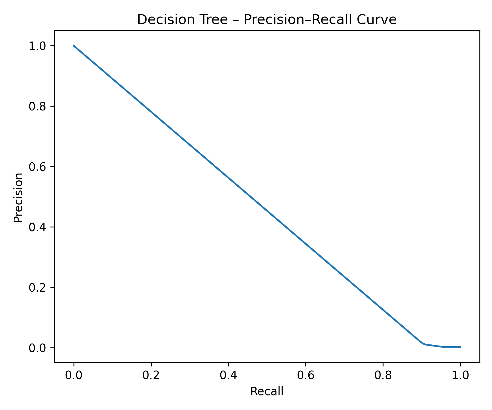

---

## Model Comparison

| Metric | Logistic Regression | Decision Tree |
|:-------|--------------------:|-------------:|
| Recall (fraud) | **91.8%** | 89.8% |
| Precision (fraud) | 6.0% | 1.8% |
| False Positives | **1,402** | 4,701 |
| ROC AUC | **0.976** | 0.908 |
| PR AUC | **0.650** | lower |

**Logistic Regression wins on every metric.**

**Why?** Logistic Regression produces smooth, well-calibrated probability scores. Decision Trees produce bimodal, rigid probabilities — fraud cases are either very confidently identified or completely missed, with little in between. Since PCA components are uncorrelated by design, the fraud signal is partly captured by linear combinations of features — exactly what Logistic Regression exploits.

---

## Key Takeaways

1. **Accuracy is misleading for imbalanced data.** Always evaluate with Recall, Precision, and AUC.
2. **Random undersampling works.** Training on a balanced 50/50 subset forces models to learn fraud patterns rather than predicting the majority class.
3. **High recall at the cost of precision is often the right call.** Whether it's worth flagging 1,402 legitimate transactions to catch 90 frauds depends on the bank's cost structure — not the model's accuracy.
4. **Logistic Regression is a strong baseline.** Before reaching for complex ensembles, a well-preprocessed Logistic Regression often performs surprisingly well.
